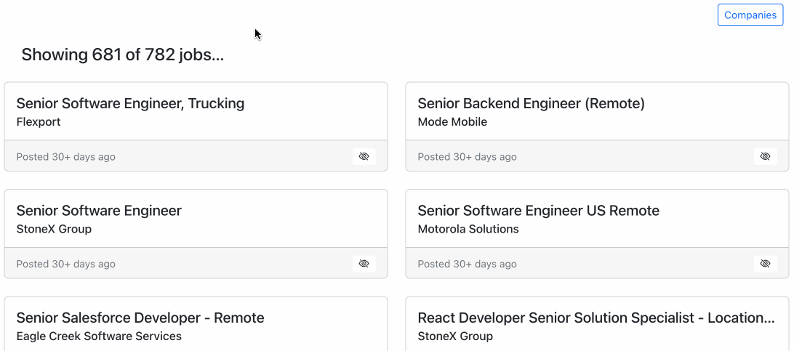

# indeed-filter



Indeed doesn't allow users to filter out job listings by company, so I'm gonna do it myself.

This is a [Spring Boot](https://spring.io/projects/spring-boot) app that serves a REST API and a 
[TypeScript](https://www.typescriptlang.org/) + [React](https://reactjs.org/) frontend that consumes that API.  
It is intended to run locally and connect to a local MySQL database storing job listings.  The database is populated 
beforehand by a local batch job that scrapes results from the [Indeed](https://www.indeed.com/) website, using code 
in another repo.

## Usage

To run the server locally,

```
./gradlew clean bootRun
```

and then go to [http://localhost:8080](http://localhost:8080).

## Development

### Frontend

The frontend code lives as a subproject in the `/frontend` folder.  When its artifacts are built with `npm run build`,
they are placed in the Spring Boot app's `src/main/resources/static` folder.  More notes on frontend development are in
the [frontend README.md](frontend/README.md).

### Backend

Run tests with

```
./gradlew clean test
```

This repo now manages the `indeed` database schema with [Flyway](https://flywaydb.org/).  Migration scripts are located
in `src/main/resources/db/migration` and you can manually kick off the migrations with
```
./gradlew flywayMigrate
```
